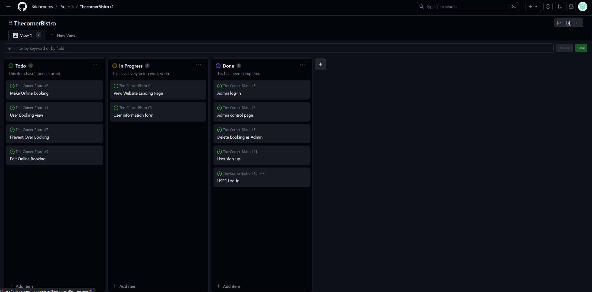
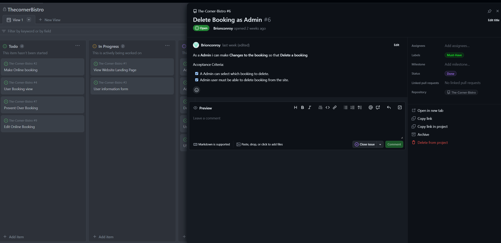
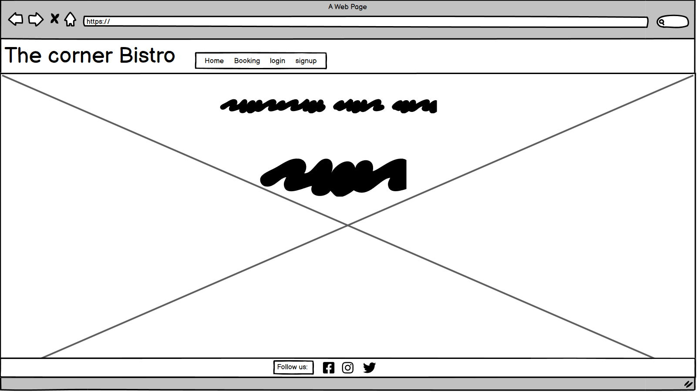
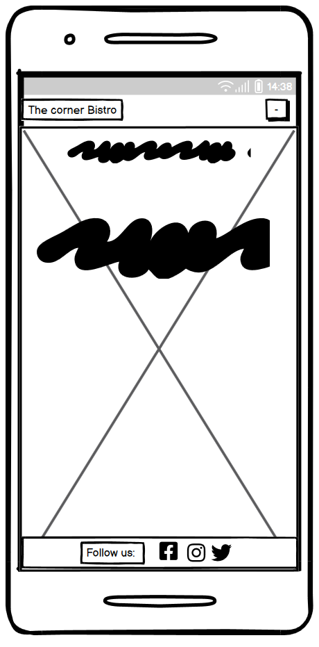

# The Corner Bistro
## Introduction
The Corner Bistro is full stack website developed to allow the owner/admin of the site to recieve, view, edit and delete restraunt bookings.
The site allows an Admin user to login using a pre-registered login(superuser) from there the Admin-user can create, read, update and delete(CRUD) bookings.
This website also allows a users to create a login, make a booking at the restruant wbesite and view an edit the bookings.
To create this website Agile principles where used. The frameworks used were bootstrap and django.

---
## Table of Contents

 - ## [Introduction](#introduction)

 - ## [Agile Methodologie](#agile-methodologie-1)

 - ## [User Experience](#user-experience-1)

 - ## [Features](#features-1)

 - ## [Technologies](#technologies-1)
    
- ## [Testing](#testing-1)
    - ## [Bugs](#bugs-1)
    - ## [Manual Testing](#manual-testing-1)
    - ## [Code Validation](#code-validation-1)
    

- ## [Deployment](#deployment-1)

- ## [Credits](#credits-1)
---

## Agile Methodologie

Agile principles were utilised throughout the planning and development of this project. The tecnoligy used in this project was github issues which were categorised into user storys, seperate out into tasks for various aspects of the project. The issues were then added into a project board through github issues as shown.

I created a user storys template through github issues to layout each user stories containing acceptance criteria. These requirements were altered through the project as things dont always go to plan and new ideas can happen. I also used the MoSCoW method while developing this project this helped to prioritize certian feature ahead of others by using tags on the user storys into three differnt actagorys (Must Haves, Should Have, Could Have). By focusing on the Must Haves first you end up with a MVP (minimuim viable prject) qiucker.

## User Experience

As a new visitor to the site, I would like to be able to make a booking and edit it acourdingly. i would also like to be able to login to the website so that i may find and edit my booking. As a returning customer, I want to be able to easily navigate the site and quickily find what I'm looking for. I would also like the ability to contact the Resteraunt directly through their website.

### The User Experience Design was constructed using the five planes.

+ Stratagy: Is this content relvent to the user and is it culturally appropriate?
+ Scope: Are we accomplishing our goals of broadcasting The Corner Bistros ethos.
+ Structure: How many pages should we have in our website and why?
+ Skeleton: Does the structure of the wireframe meet the users needs? Is the web page responsive?
+ Surface: Does the site look good visully? Does it have enough images and colours?

Desktop Landing Page
 

Mobile Landing Page
 

## Features

## Technologies

### Libraries, Frameworks, Tools

* [Django 3.2.22](https://www.djangoproject.com/)
* [Bootstrap 4.6.2](https://getbootstrap.com/docs/4.6/getting-started/introduction/)
* [Heroku]((https://www.heroku.com))
* [ElephantSQL](https://www.elephantsql.com/)
* [SQLite3](https://www.sqlite.org/index.html)
* [Google Fonts](https://fonts.google.com/)
* [Cloudinary 1.36.0](https://cloudinary.com/)
* [Gunicorn 21.2.0](https://gunicorn.org/)
* [Psycopg2 2.9.9](https://pypi.org/project/psycopg2/)
* [GitPod](https://www.gitpod.io/)
* [GitHub](https://github.com/)
* [FontAwesome](https://fontawesome.com/)
* [W3C Validator](https://validator.w3.org/)
* [W3C CSS Validator](https://jigsaw.w3.org/css-validator/)
* [CI pep8 linter](https://pep8ci.herokuapp.com/)
* [Lighthouse](https://developer.chrome.com/docs/lighthouse/overview/)
* [Balsamiq](https://balsamiq.com/wireframes/?gad=1&gclid=CjwKCAjwr_CnBhA0EiwAci5sikJlbA3yk1dYGRdNiY0Krv7_98bWbqabFd_DxfjzG1-J7kWnl2-byhoC2cIQAvD_BwE)

### Languages

* [HTML5](https://www.w3schools.com/html/)
* [CSS3](https://www.w3schools.com/css/)
* [Python 3.9](https://www.python.org/downloads/release/python-390/)

## Testing

### Bugs
### Manual Testing
### Code Validation

## Deployment

## Credits

### Media

Background image was taken from [pexels](https://www.pexels.com/search/bistro/)

Favicon was generated by [favicon](https://favicon.io/favicon-generator/)
