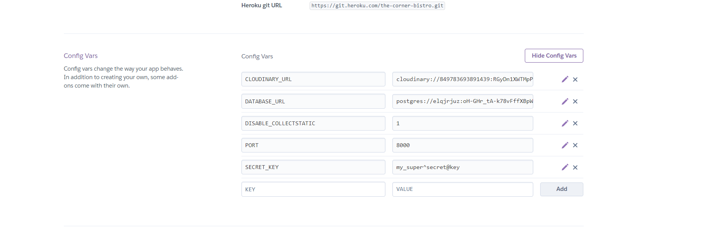
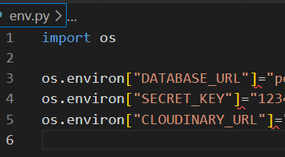
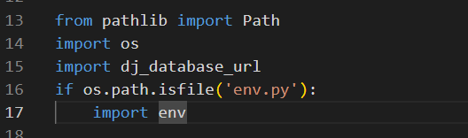
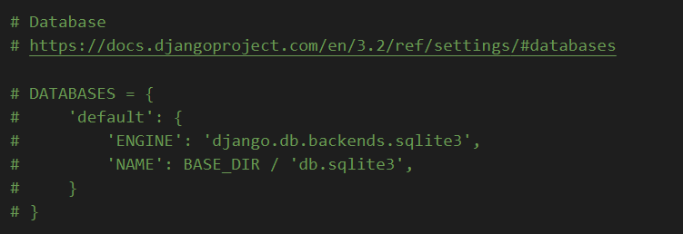
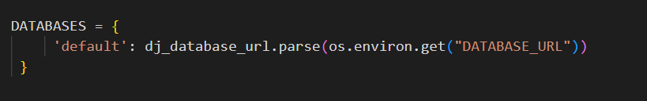
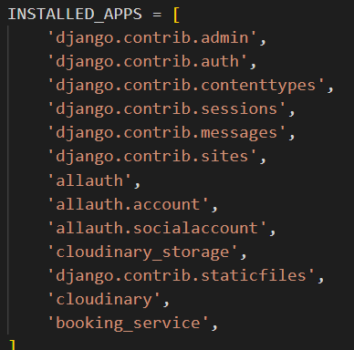
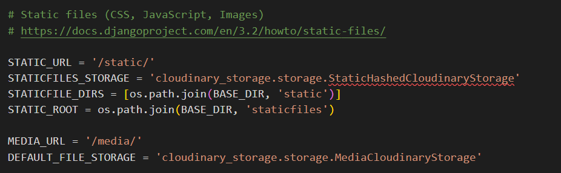
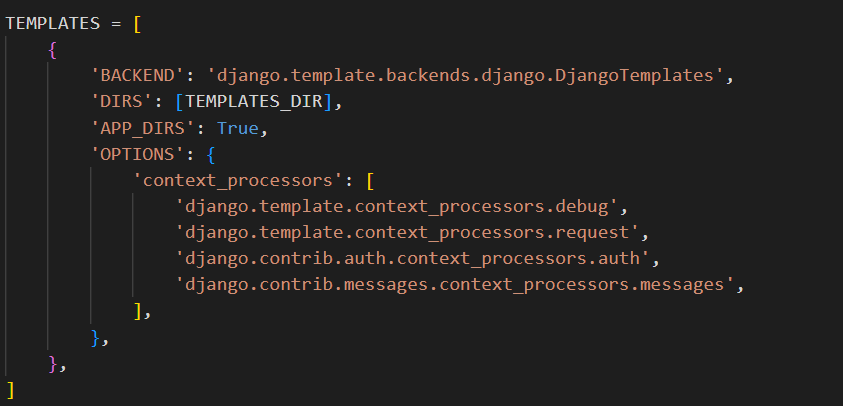

# The Corner Bistro
## Introduction
The Corner Bistro is full stack website developed to allow the owner/admin of the site to recieve, view, edit and delete restraunt bookings.
The site allows an Admin user to login using a pre-registered login(superuser) from there the Admin-user can create, read, update and delete(CRUD) bookings.
This website also allows a users to create a login, make a booking at the restruant wbesite and view an edit the bookings.
To create this website Agile principles where used. The frameworks used were bootstrap and django.

---
## Table of Contents

 - ## [Introduction](#introduction)

 - ## [Agile Methodologie](#agile-methodologie-1)

 - ## [User Experience](#user-experience-1)

 - ## [Features](#features-1)

 - ## [Technologies](#technologies-1)
    
- ## [Testing](#testing-1)
    - ## [Bugs](#bugs-1)
    - ## [Manual Testing](#manual-testing-1)
    - ## [Code Validation](#code-validation-1)
    

- ## [Deployment](#deployment-1)

- ## [Credits](#credits-1)
---

## Agile Methodologie

Agile principles were utilised throughout the planning and development of this project. The tecnoligy used in this project was github issues which were categorised into user storys, seperate out into tasks for various aspects of the project. The issues were then added into a project board through github issues as shown.

Agile
 

I created a user storys template through github issues to layout each user stories containing acceptance criteria. These requirements were altered through the project as things dont always go to plan and new ideas can happen. I also used the MoSCoW method while developing this project this helped to prioritize certian feature ahead of others by using tags on the user storys into three differnt actagorys (Must Haves, Should Have, Could Have). By focusing on the Must Haves first you end up with a MVP (minimuim viable prject) qiucker.

User Storys
 

## User Experience

As a new visitor to the site, I would like to be able to make a booking and edit it acourdingly. i would also like to be able to login to the website so that i may find and edit my booking. As a returning customer, I want to be able to easily navigate the site and quickily find what I'm looking for. I would also like the ability to contact the Resteraunt directly through their website.

### The User Experience Design was constructed using the five planes.

+ Stratagy: Is this content relvent to the user and is it culturally appropriate?
+ Scope: Are we accomplishing our goals of broadcasting The Corner Bistros ethos.
+ Structure: How many pages should we have in our website and why?
+ Skeleton: Does the structure of the wireframe meet the users needs? Is the web page responsive?
+ Surface: Does the site look good visully? Does it have enough images and colours?

Desktop Landing Page
 

Mobile Landing Page
 

## Features

## Technologies

### Libraries, Frameworks, Tools

* [Django 3.2.22](https://www.djangoproject.com/)
* [Bootstrap 4.6.2](https://getbootstrap.com/docs/4.6/getting-started/introduction/)
* [Heroku]((https://www.heroku.com))
* [ElephantSQL](https://www.elephantsql.com/)
* [SQLite3](https://www.sqlite.org/index.html)
* [Google Fonts](https://fonts.google.com/)
* [Cloudinary 1.36.0](https://cloudinary.com/)
* [Gunicorn 21.2.0](https://gunicorn.org/)
* [Psycopg2 2.9.9](https://pypi.org/project/psycopg2/)
* [GitPod](https://www.gitpod.io/)
* [GitHub](https://github.com/)
* [FontAwesome](https://fontawesome.com/)
* [W3C Validator](https://validator.w3.org/)
* [W3C CSS Validator](https://jigsaw.w3.org/css-validator/)
* [CI pep8 linter](https://pep8ci.herokuapp.com/)
* [Lighthouse](https://developer.chrome.com/docs/lighthouse/overview/)
* [Balsamiq](https://balsamiq.com/wireframes/?gad=1&gclid=CjwKCAjwr_CnBhA0EiwAci5sikJlbA3yk1dYGRdNiY0Krv7_98bWbqabFd_DxfjzG1-J7kWnl2-byhoC2cIQAvD_BwE)

### Languages

* [HTML5](https://www.w3schools.com/html/)
* [CSS3](https://www.w3schools.com/css/)
* [Python 3.9](https://www.python.org/downloads/release/python-390/)

## Testing

### Bugs
### Manual Testing
### Code Validation

## Deployment

The first thing you should do when creating a new project is to deploy it as quick as you can to prevent any nasty errors that might be a pain to fix when your project is complete. For this project I used Heroku to deploy too. The framework I used in this project was Django, so the first thing you need to do is to create a Django project in you work space and install all the supporting libraries. Once evrthing is installed you should you should make a migration to the database with a small model to make sure everything works.

Just to make a note of this the database used in the workspace (db.sqlite3) does not work when deployed to Heroku so we need a differnt database when deplying. I used ElephantSQL database as it was free and works with Heroku.

### Installing Django and Libraries

+ Step 1: Django and Gunicorn installation enter in the terminal:

        pip3 install 'django<4' gunicorn
+ Step 2: Install Supporting Libraries in the terminal:

        pip3 install dj_database_url==0.5.0 psycopg2
+ Step 3: Install Cloudinary Libraries in the terminal:

        pip3 install dj3-cloudinary-storage
        pip3 install urllib3==1.26.15
+ Step 4: Create a requirements file in the terminal:

        pip3 freeze --local > requirements.txt
+ Step 5: Create a Project in the terminal:

        django-admin startproject *Your Project name*.
+ Step 6: Create a App in the terminal:

        python3 manage.py startapp *App name*
+ Step 7: Add App name to the  Installed Apps in setting.py file.

+ Step 8: Migrate the changes enter in the terminal:

        python3 manage.py migrate
+ Step 9: Run the local server to make sure that everthing works, enter in the terminal:

        python3 manage.py runserver
+ Step 10: Add your local URL from the preview page to your setting.py file in the section thats called ALLOWED HOST. You must also Add your Heroku URL here too.

+ Step 11: Create ElephantSQL Database, by creating/login to your account, creating a new instance, and copying the URL into Heroku (See step 13)

+ Step 12: Create a new Heroku project by creating/login to your account and clicking (Create new app). Pick a name for your project and the region that your project is base in. Then click CREATE APP.

+ Step 13: In the Heroku app setting click on Reveal Config Vars, add DATABASE_URL as a value with the URL from ElephantSQL as the Key. Repeat this step for SECRET_KEY, DEBUG, CLOUDINARY_URL, Port and DISABLE_COLLECTSTATIC as seen in the image below.

    

    
config var Image
 

    

    

+ Step 14: IN your workspace create an env.py file to store all your sensative data, like in step 13 add your DATABASE_URL, SECRET_KEY and CLOUDINARY_URL to this file. at the top of this file add import os.

    

    
Env.py
 

    

    

+ Step 15: Go back to setting.py file and at the top add these lines of code

        from pathlib import Path
        import os
        import dj_database_url
        if os.path.isfile('env.py'):
            import env

    

    
Top of Setting.py
 

    

    

+ Step 16: In Setting.py find where it say SECRET_KEY and replace it with:

        SECRET_KEY = os.environ.get('SECRET_KEY')

+ Step 17: IN setting.py find the section DATABASES and comment out the section of code.

    

    
Database Comment Out
 

    

    

+ Step 18: IN setting.py just below DATABASES the commented out section, add this code.

        DATABASES = {
            'default': dj_database_url.parse(os.environ.get("DATABASE_URL"))
        }

    

    
Database Add
 

    

    

+ Step 19: At this point it is a good idea to make a migration, so in the terminal:

        python3 manage.py migrate

+ Step 20: IN setting.py in the Installed Apps section add (location added is importent see image below):

        'cloudinary_storage',
        'cloudinary',

    

    
Cloudinary
 

    

    

+ Step 21: IN setting.py find the area called Static files and add this code.(makes Django use cloudinary for storing static files)

        STATIC_URL = '/static/' STATICFILES_STORAGE = ('cloudinary_storage.storage.' 'StaticHashedCloudinaryStorage') STATICFILES_DIRS = [os.path.join(BASE_DIR, 'static'), ] STATIC_ROOT = os.path.join(BASE_DIR, 'staticfiles')

        MEDIA_URL = '/media/' DEFAULT_FILE_STORAGE = 'cloudinary_storage.storage.MediaCloudinaryStorage'

        DEFAULT_AUTO_FIELD = 'django.db.models.BigAutoField'

    

    
Cloudinary Static
 

    

    

+ Step 22: IN setting.py add this code just below BASE_DIR

        TEMPLATES_DIR = os.path.join(BASE_DIR, 'templates')

+ Step 23: create 3 new in the base directory static templates and media

+ Step 24: IN setting.py In the templates array add this:

        'DIRS': [TEMPLATES_DIR],

    

    
TEMPLATES
 

    

    

+ Step 25: Add a Procfile to the root directory make sire the Procfile has a capital P. In the Procfile add this code:

        web: gunicorn cornerbistro.wsgi

+ Step 26: In your Heroku app navigate to the setting and add buildpack: heroku/python.

+ Step 27: Link your GitHub Repo to your project.

+ Step 28: Navigate to the deploy section and click on Automatic deployment (mian)

+ Step 29: Well done!!

## Credits

### Media

Background image was taken from [pexels](https://www.pexels.com/search/bistro/)

Favicon was generated by [favicon](https://favicon.io/favicon-generator/)
