# The Corner Bistro 

## Introduction 

The Corner Bistro is full stack website developed to allow the owner/admin of the site to recieve, view, edit and delete restraunt bookings. 

The site allows an Admin user to login using a pre-registered login(superuser) from there the Admin-user can create, read, update and delete(CRUD) bookings. 

This website also allows a users to create a login, make a booking at the restruant wbesite and view an edit the bookings. 

To create this website Agile principles where used. The frameworks used were bootstrap and django. 

 
 

--- 

## Table of Contents 

 
 

 - ## [Introduction](#introduction) 

 
 

 - ## [Agile Methodologie](#agile-methodologie-1) 

 
 

 - ## [User Experience](#user-experience-1) 

 
 

 - ## [Features](#features-1) 

 
 

 - ## [Technologies](#technologies-1) 

     

- ## [Testing](#testing-1) 

    - ## [Bugs](#bugs-1) 

    - ## [Manual Testing](#manual-testing-1) 

    - ## [Code Validation](#code-validation-1) 

    - ## [Responsiveness Testing](#responsiveness-testing-1) 

     

 
 

- ## [Deployment](#deployment-1) 

 
 

- ## [Credits](#credits-1) 

--- 

 
 

## Agile Methodologie 

 
 

Agile principles were utilised throughout the planning and development of this project. The tecnoligy used in this project was github issues which were categorised into user storys, seperate out into tasks for various aspects of the project. The issues were then added into a project board through github issues as shown. 

 
 

 

 
 

Agile
  

 
 

 

 
 

 

 
 
 

I created a user storys template through github issues to layout each user stories containing acceptance criteria. These requirements were altered through the project as things dont always go to plan and new ideas can happen. I also used the MoSCoW method while developing this project this helped to prioritize certian feature ahead of others by using tags on the user storys into three differnt actagorys (Must Haves, Should Have, Could Have). By focusing on the Must Haves first you end up with a MVP (minimuim viable prject) qiucker. 

 
 

 

 
 

User Storys
  

 
 

 

 
 

 

 
 

## User Experience 

 
 

As a new visitor to the site, I would like to be able to make a booking and edit it acourdingly. i would also like to be able to login to the website so that i may find and edit my booking. As a returning customer, I want to be able to easily navigate the site and quickily find what I'm looking for. I would also like the ability to contact the Resteraunt directly through their website. 

 
 

### The User Experience Design was constructed using the five planes. 

 
 

+ Stratagy: Is this content relvent to the user and is it culturally appropriate? 

+ Scope: Are we accomplishing our goals of broadcasting The Corner Bistros ethos. 

+ Structure: How many pages should we have in our website and why? 

+ Skeleton: Does the structure of the wireframe meet the users needs? Is the web page responsive? 

+ Surface: Does the site look good visully? Does it have enough images and colours? 

 
 

 

 
 

Desktop Landing Page
  

 
 

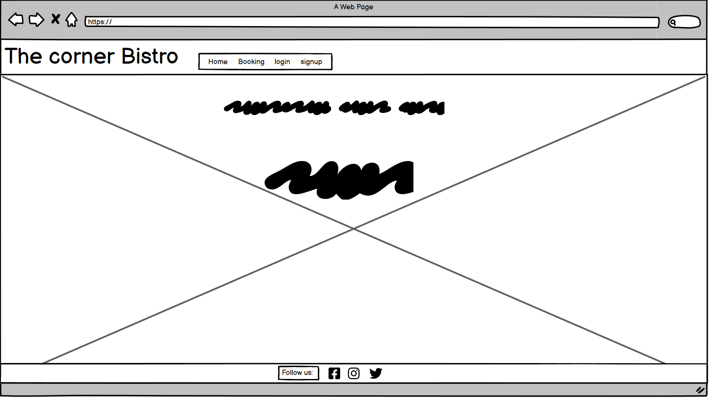 

 
 

 

 
 

 

 
 

Mobile Landing Page
  

 
 

 

 
 

 

 
 

## Features 

 
 

### Header 

 
 

+ The header contains the name of the website and when you click on it it will bring you to the landing page. 

+ The header also contains a sticky navbar, the navbar has four differnt heading the heading will change if you are login from login to loggout. Bookimg will only apear if you are logged in. 

+ the header reflects the login state of the user by showing the login or the log out icon inthe header. 

 
 

 

 
 

Login
  

 
 

 

 
 

 

 
 

 

 
 

Booking
  

 
 

 

 
 

 

 
 

### Menu 

 
 

+ The menu informs users what the can expect when going to the restaurnt 

 
 

 

 
 

Menu
 

 
 

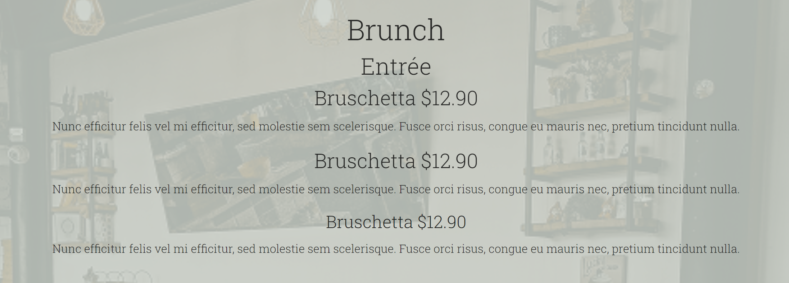 

 
 

 

 
 

### Login  

 
 

+ The log in on the navbar will disapear when you have logged in confreming your login 

+ on the login form you can also sign up if you havent alread done so. 

 
 

 

 
 

login
 

 
 

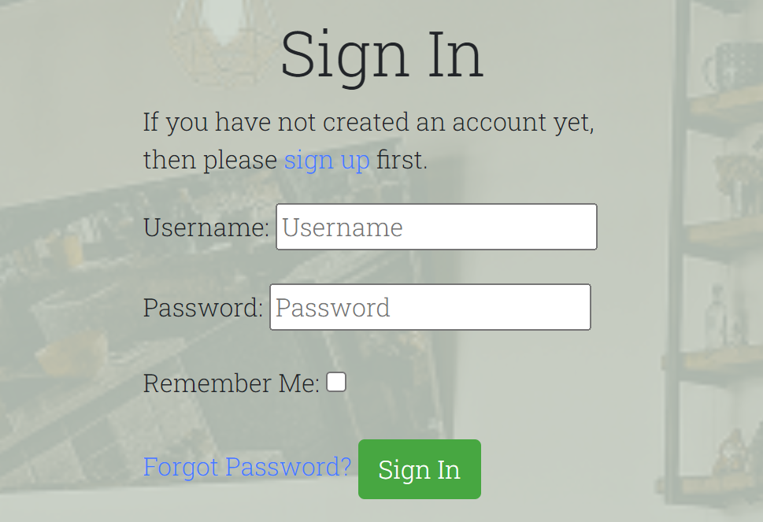 

 
 

 

 
 

### Logout 

 
 

+ By clicking on the log-out in the navbar it will bing you to another page were it will ask you again would you like to sign out. 

 
 

 

 
 

logout
 

 
 

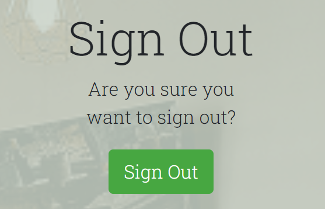 

 
 

 

 
 

### Sign Up 

 
 

+ The sign up form allows users to sign up to the website to make booking. 

 
 

 

 
 

Sign up
 

 
 

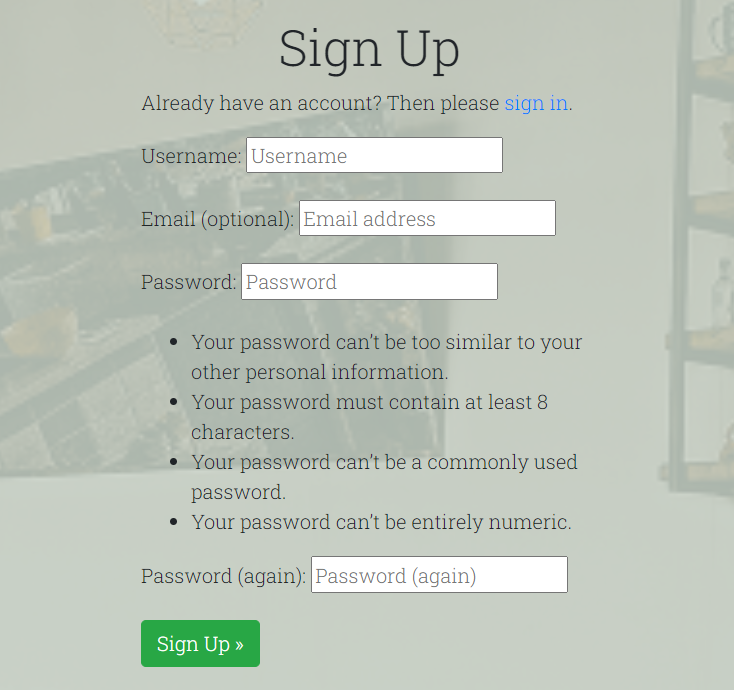 

 
 

 

 
 

### Booking Form 

 
 

+ The booking form can only be accessed if you have loged in. 

+ The form contains all the relative information for a user to make a booking. 

 
 

 

 
 

Booking form
 

 
 

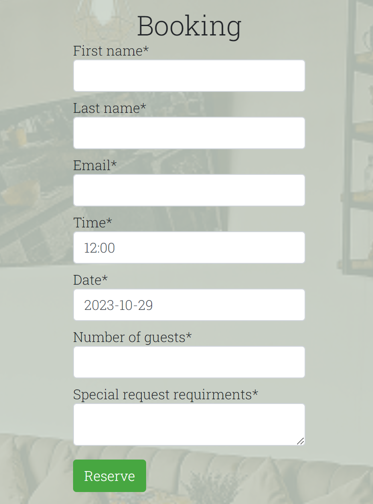 

 
 

 

 
 

## Technologies 

 
 

### Libraries, Frameworks, Tools 

 
 

* [Django 3.2.22](https://www.djangoproject.com/) 

* [Bootstrap 4.6.2](https://getbootstrap.com/docs/4.6/getting-started/introduction/) 

* [Heroku](https://www.heroku.com) 

* [ElephantSQL](https://www.elephantsql.com/) 

* [SQLite3](https://www.sqlite.org/index.html) 

* [Google Fonts](https://fonts.google.com/) 

* [Cloudinary 1.36.0](https://cloudinary.com/) 

* [Gunicorn 21.2.0](https://gunicorn.org/) 

* [Psycopg2 2.9.9](https://pypi.org/project/psycopg2/) 

* [GitPod](https://www.gitpod.io/) 

* [GitHub](https://github.com/) 

* [FontAwesome](https://fontawesome.com/) 

* [W3C Validator](https://validator.w3.org/) 

* [W3C CSS Validator](https://jigsaw.w3.org/css-validator/) 

* [CI pep8 linter](https://pep8ci.herokuapp.com/) 

* [Lighthouse](https://developer.chrome.com/docs/lighthouse/overview/) 

* [Balsamiq](https://balsamiq.com/wireframes/?gad=1&gclid=CjwKCAjwr_CnBhA0EiwAci5sikJlbA3yk1dYGRdNiY0Krv7_98bWbqabFd_DxfjzG1-J7kWnl2-byhoC2cIQAvD_BwE) 

 
 

### Languages 

 
 

* [HTML5](https://www.w3schools.com/html/) 

* [CSS3](https://www.w3schools.com/css/) 

* [Python 3.9](https://www.python.org/downloads/release/python-390/) 

 
 
 

## Testing 

 
 

### Bugs 

 
 

+ My login, logout and signup template from allauth where not loading my base templates. 

  + The fix was to move my booking_service app in the installeed app section in setting.py above the allauth installed app. this means the booking_service app was loading first. 

 
 

### Manual Testing 

 
 

### Features Testing

**Navbar**

|Test  | Expected Outcome  | Pass or Fail |
|--|--|--|
| The Corner Bistro Logo present | Yes  | Pass |
| Click Logo in navbar | Home page Redirect | Pass |
| Click Home in navbar | Home page Redirect | Pass |
| Click Menu in navbar| Bring user to menu page | Pass |
| Click Log-in | Redirect to Log-in page | Pass |
| Click Log-out | Redirect to Log-out page | Pass |
| Click Sign-up | Redirect to Sign-up page | Pass |
| If user Logged in booking apears in navbar | log-in disapears and booking apears | Pass |
| Click Booking in navbar | Redirect to Booking page | Pass |

**Booking Form**

|Test  | Expected Outcome  | Pass or Fail |
|--|--|--|
| Booking form only apear in navbar if logged in | Yes  | Pass |
| First name must be entered for the form to be submitted | Yes  | Pass |
| Last name must be entered for the form to be submitted | Yes | Pass |
| Email must be entered for the form to be submitted | Yes | Pass |
| Time field apear with start time of 12:00 | Yes | Pass |
| Date field apear with todays date | Yes | Pass |
| Number of guest field only excepts number | Yes | Pass |
| Special Request/Requirments field must take information | Yes | Pass |
| Clicking Reserve button send booking to the database | Yes | Pass |

**Booking Detials**

|Test  | Expected Outcome  | Pass or Fail |
|--|--|--|
| Booking details page will only apear after you've made a booking | Yes  | Pass |
| Booking details page will only show your booking | It shows you all the booking on the database  | Fail |
| Clicking Cancel will return you to the home page | Yes | Pass |
| Clicking Cancel will give you confermation of your cancelation | No  | Fail |
| Clicking Update Booking will update booking | No | Fail |
| Clicking Update Booking will also return you to the home page | No | Fail |
| Clicking Update Booking will give you confermation of updated booking | No | Fail |

**Sign-up**

|Test  | Expected Outcome  | Pass or Fail |
|--|--|--|
| Sign-up form creates an account on the database | Yes  | Pass |
| Form must have a username to create an account | Yes  | Pass |
| Form must have a passwoard to create an account | Yes  | Pass |
| Account will only be created if password is entered twice correctly | Yes  | Pass |
| Form doesnt have to have email but will except it if user wants | Yes  | Pass |
| The sign up button will redirect you to home page | Yes  | Pass |
| The sign up button will log you in | Yes  | Pass |

**Sign-in**

|Test  | Expected Outcome  | Pass or Fail |
|--|--|--|
| Sign-in form signs in a user if information is correct  | Yes  | Pass |
| Sign-in form dose not signs in a user if information is incorrect  | Yes  | Pass |
| Sign-in form throughts a (The username and/or password you specified are not correct.) if password is incorecect| Yes  | Pass |
| Sign-in form throughts a (The username and/or password you specified are not correct.) if username is incorecect| Yes  | Pass |
| The Rememeber Me if toggled remembers users information | Yes  | Pass |
| Clicking sign-in button will sign you in | Yes  | Pass |
| Clicking sign-in button will also return you to the home page if clicked | Yes  | Pass |
| Clicking Forgot Password will send you reset password email | it return a error 500 | Fail |

**Sign-out**

|Test  | Expected Outcome  | Pass or Fail |
|--|--|--|
| Sign-out will only apear in navbar if signed in | Yes  | Pass |
| Sign-out message apear on page asking you are you sure you want to sign out | Yes  | Pass |
| clicking Sign-out will redirect user to home page | Yes  | Pass |

### User Stories Testing

#### 1. Pages

| **ID** | **User Story** |**As a..** | **Acceptance Criteria:** | **Pass / Fail / In Progress** |
|-------------|------------|---------------------|-------------------|-------------------|
| 1 | View Website Landing Page | As a user I can navigate to the website so that I can make a booking | The Restaurant will need a visible landing page for customers to view.The page must have a navbar in header. The page should have an introductory paragraph. The page should have social media links in the footer. | Pass |
| 12 | View Menu Page | As a user i can view the menu so that Information of what's i can eat in the Restaurant. | Menu button in the home page navbar. Navbar button brings me to a separate page. The new page shows me the menu. | Pass |

#### 2. Admin

| **ID** | **User Story** |**As a..** | **Acceptance Criteria:** | **Pass / Fail / In Progress** |
|-------------|------------|---------------------|-------------------|-------------------|
| 8 | Admin Control Page | As a Admin user i can view and manipulate bookings so that I con received booking data | That a authenticated Admin user can select and view date and times for booking information. | Pass |
| 6 | Delete Booking as Admin | As a Admin i can make Changes to the booking so that Delete a booking | A Admin can select which booking to delete. Admin user must be able to delete booking from the site. | Pass |

#### 3. User

| **ID** | **User Story** |**As a..** | **Acceptance Criteria:** | **Pass / Fail / In Progress** |
|-------------|------------|---------------------|-------------------|-------------------|
| 11 | User Sign-up | As a User I want to be able to sign-up so that I can see my booking | Must be linked to sign up page in the navbar. Must have a form to get users personal information. Should return you to the home page after sign up. | Pass |
| 10 | User Log-in | As a User i can make a Log-in so that edit my booking |  Create a Log-in form for the user with password to protect user data. Store basic customer information on database system. | Pass |
| 2 | Make online Booking | As a User I can access an online booking form so that I can make my online booking. |  There must be a button on the page in order to redirect the customer to a form for making a booking. This form must ask for User details for making a booking. All the User booking details must be saved to data base. | Pass |
| 3 | User Information Form | In order to make a booking as a user I want to fill out a form so the Restaurant knows my details about my booking. | Have a link on the home page that redirects to the form. The form must contain all relevant booking details. Admin must be able to see all the booking in admin panal. | Pass |

#### 4. Im Progress

| **ID** | **User Story** |**As a..** | **Acceptance Criteria:** | **Pass / Fail / In Progress** |
|-------------|------------|---------------------|-------------------|-------------------|
| 4 | User Booking view | As a user i can view my online booking so that I can make changes to it | Once User logs-in they can view there booking details. Once User logs-in they can make changes to there bookings. | In Progress |
| 9 | Edit Online Booking | As a User I wont to be able to edit my booking make a change if i need too. | A User can select there booking to edit. A User must be able to change they data of that booking. A User can get confirmation of change in there booking. | In Progress |

#### 4. Potentail Features

| **ID** | **User Story** |**As a..** | **Acceptance Criteria:** | **Pass / Fail / In Progress** |
|-------------|------------|---------------------|-------------------|-------------------|
| 7 | Prevent Over Booking | In order to avoid over booking as a user I can access the booking log which checks for availability. | The create log that checks if the Restaurant has availability in the database. The user can view this log. | Fail |
| 13 | Log-in with third party account | As a User i can login with my google account so that i don't have to se up an account with the restaurant | In log-in page there should be a button that allows me to sign in with my google account | Fail |RGyDn1XWTMpPyycY4Ewfn20lNwE@du4zinzmk"
### Code Validation 

 
 

### HTML 

 
 

+ Before I deployed my App for the final time. I ran the code throught the validator and it pass. 

 
 

 

 
 

W3C Validation HTML
 

 
 

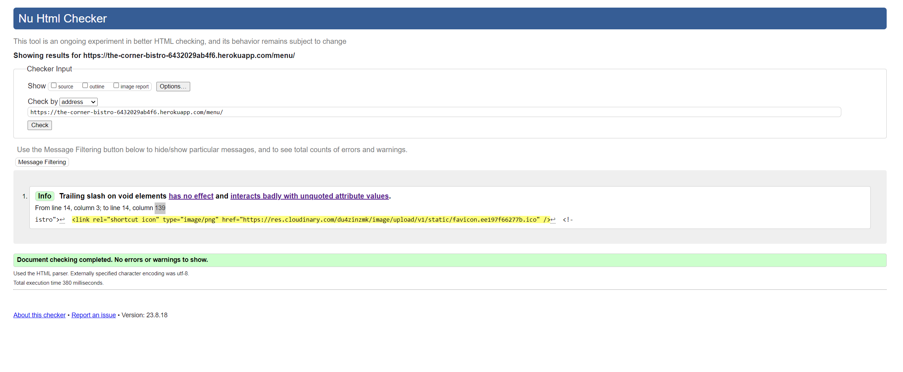 

 
 

 

 
 

### CSS 

 
 

+ Before I deployed my App for the final time. I ran the code throught the validator and it pass. 

 
 

 

 
 

W3C Validation CSS
 

 
 

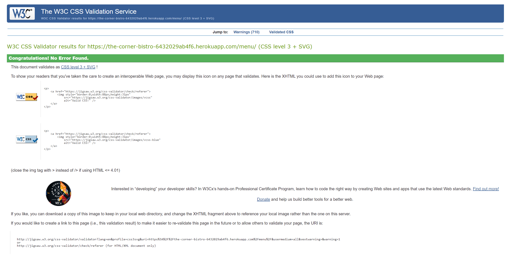 

 
 

 

 
 

### Python 

 
 

+ Before I deployed my App for the final time. I ran the code throught the PEP8 validator and it pass. 

 
 

 

 
 

view.py
 

 
 

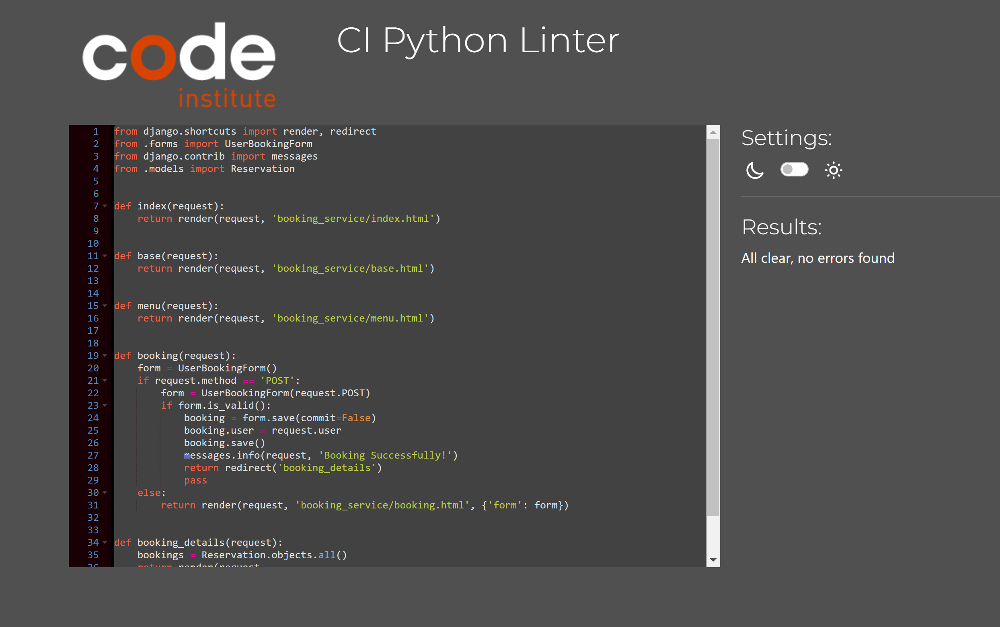 

 
 

 

 
 

 

 
 

setting.py
 

 
 

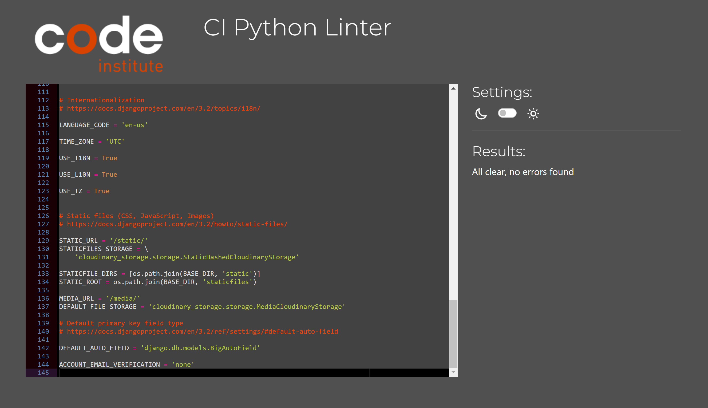 

 
 

 

 
 

 

 
 

models.py
 

 
 

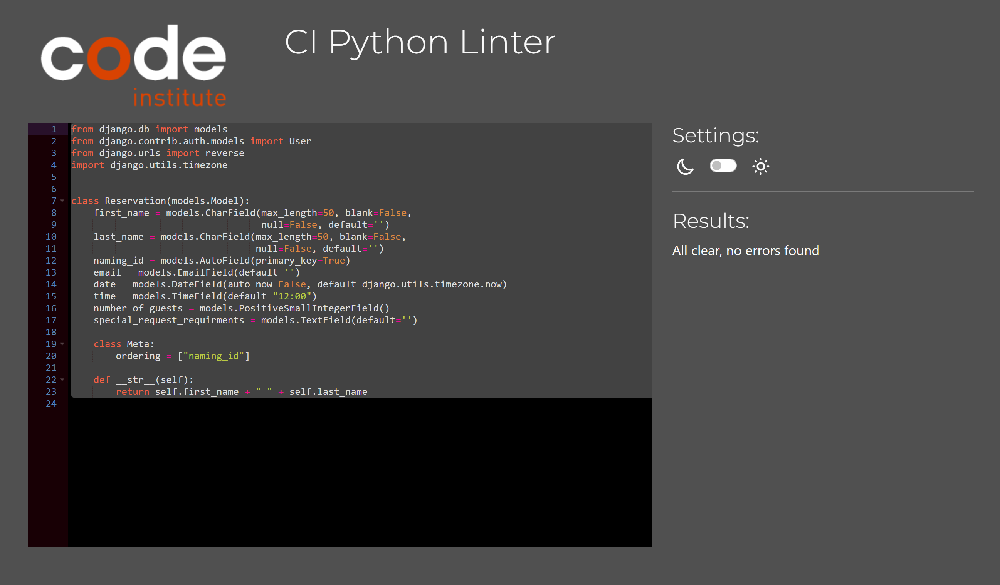 

 
 

 

 
 

 

 
 

form.py
 

 
 

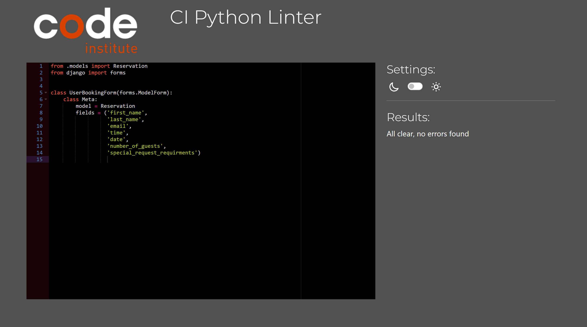 

 
 

 

 
 

 

 
 

corner bistro url.py
 

 
 

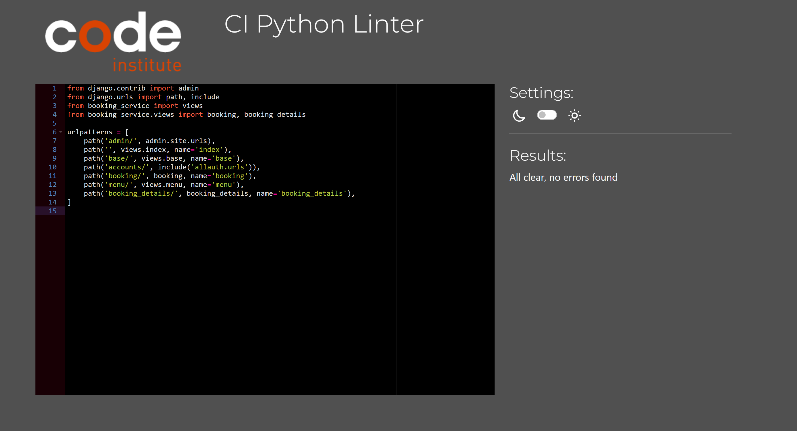 

 
 

 

 
 

 

 
 

booking service url.py
 

 
 

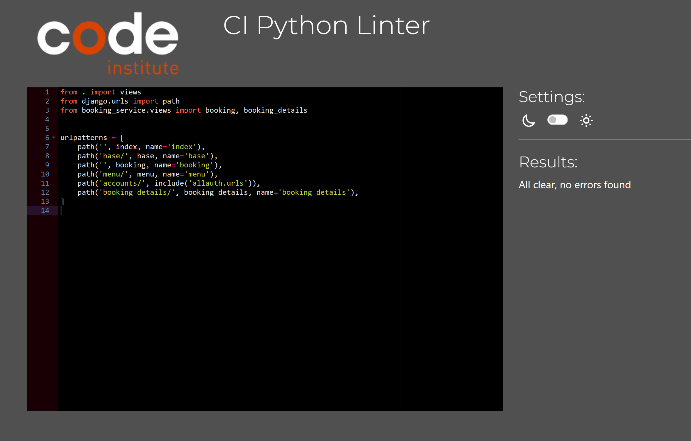 

 
 

 

 
 

 

 
 

app.py
 

 
 

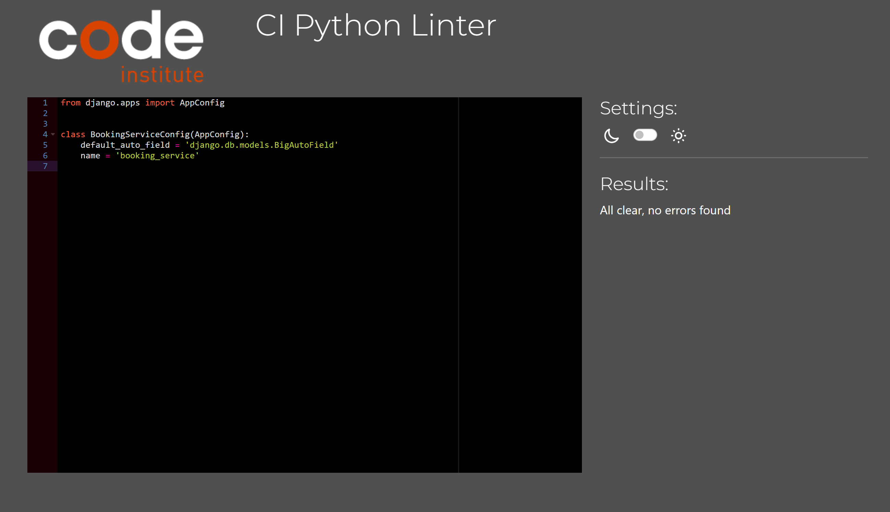 

 
 

 

 
 

 

 
 

admin.py
 

 
 

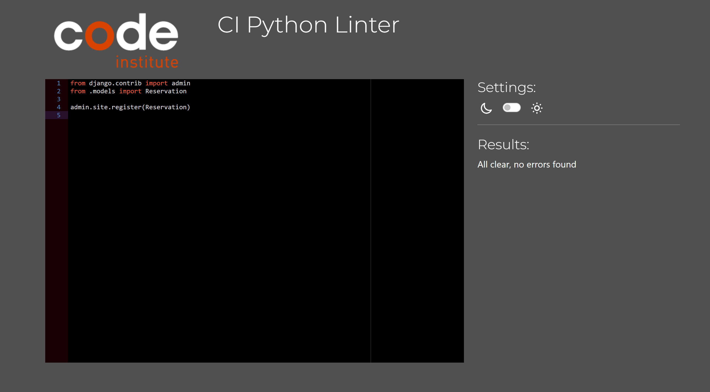 

 
 

 

 
 

## Responsiveness Testing 

 
 

### Lighthouse 

 
 

+ I used the chrome developer tool light house witch gave me the insight of how my webpage looked on diffent screens everything looked great on each page and when i ran the light house analizs these are the score i got returned to me. 

 
 

 

 
 

Booking page
 

 
 

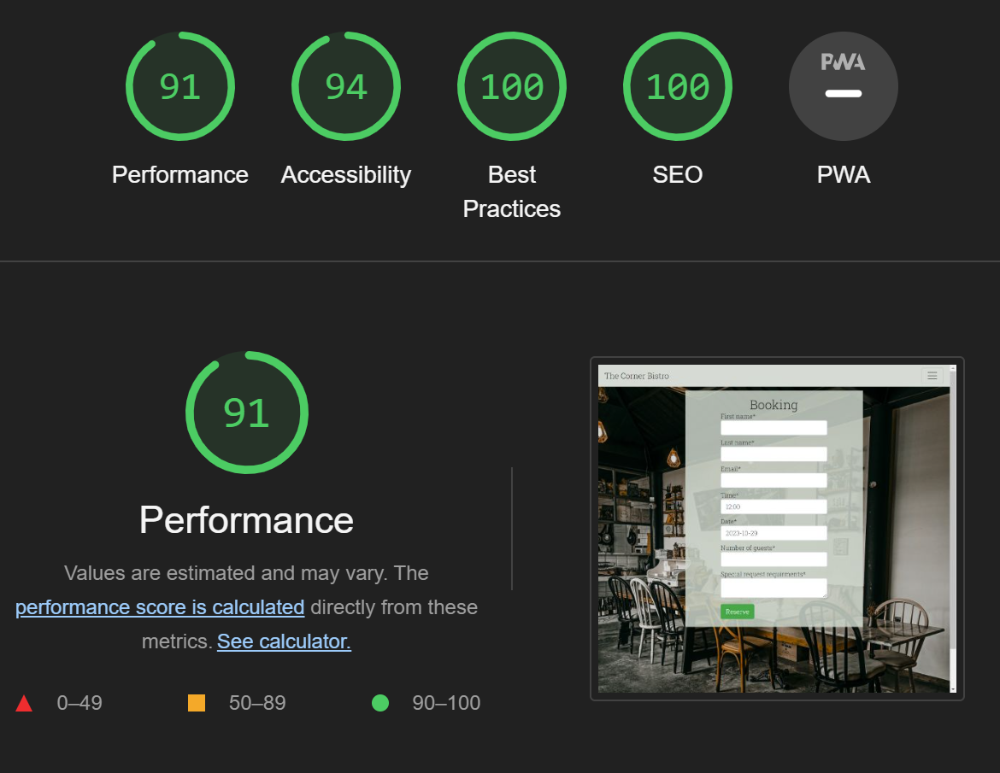 

 
 

 

 
 

 

 
 

Home page
 

 
 

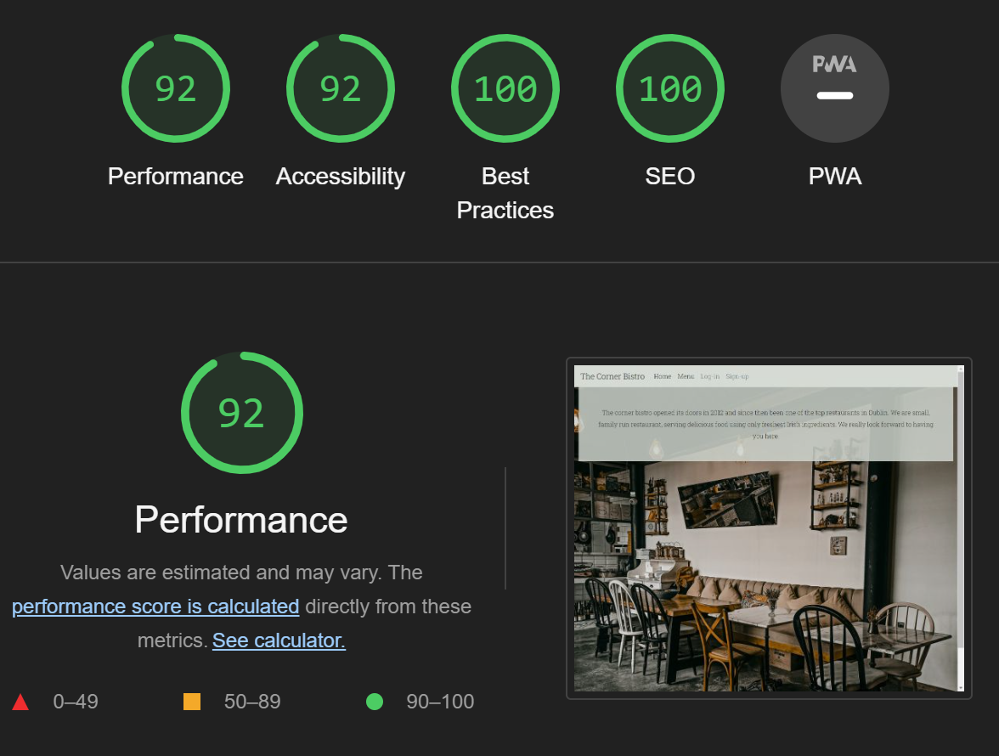 

 
 

 

 
 

 

 
 

login page
 

 
 

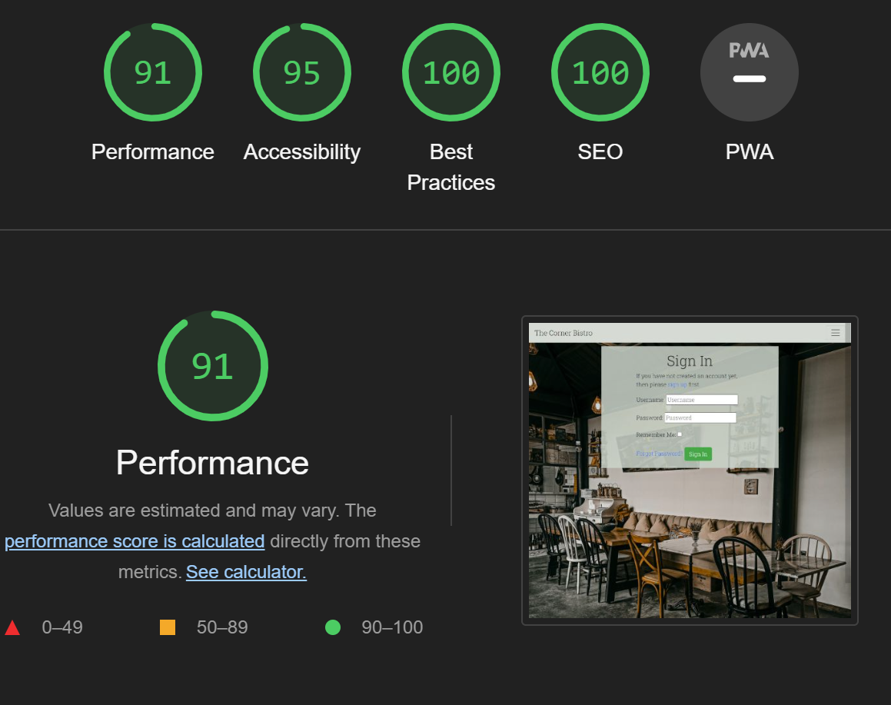 

 
 

 

 
 

 

 
 

Menu page
 

 
 

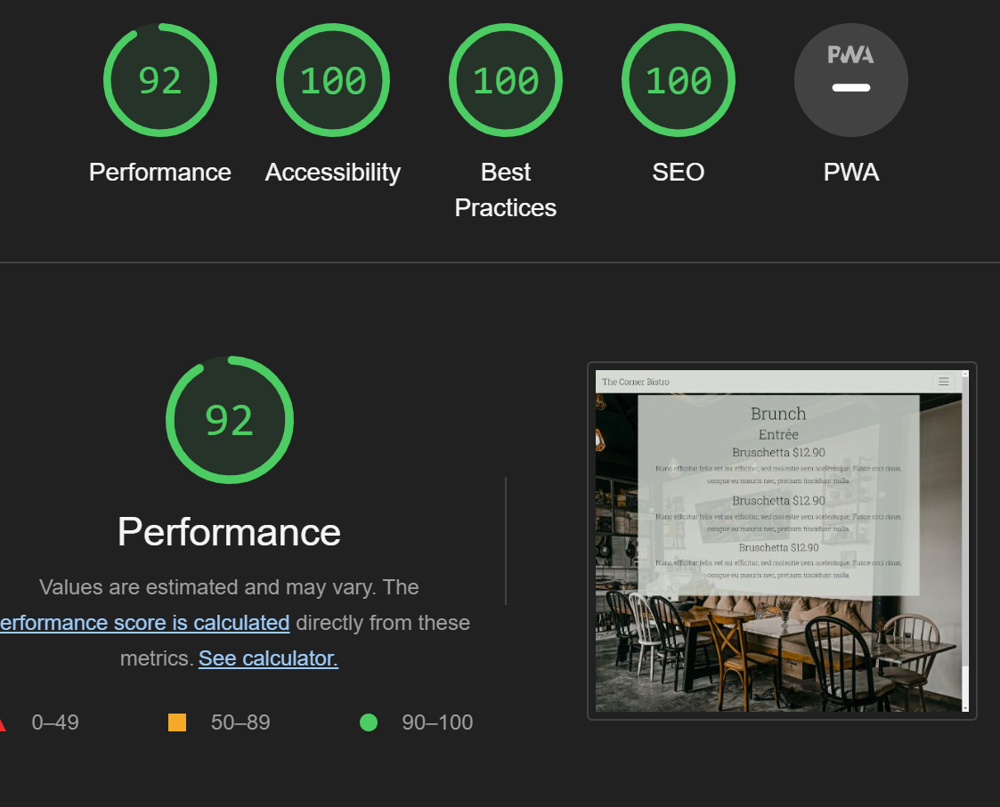 

 
 

 

 
 

 

 
 

Menu page
 

 
 

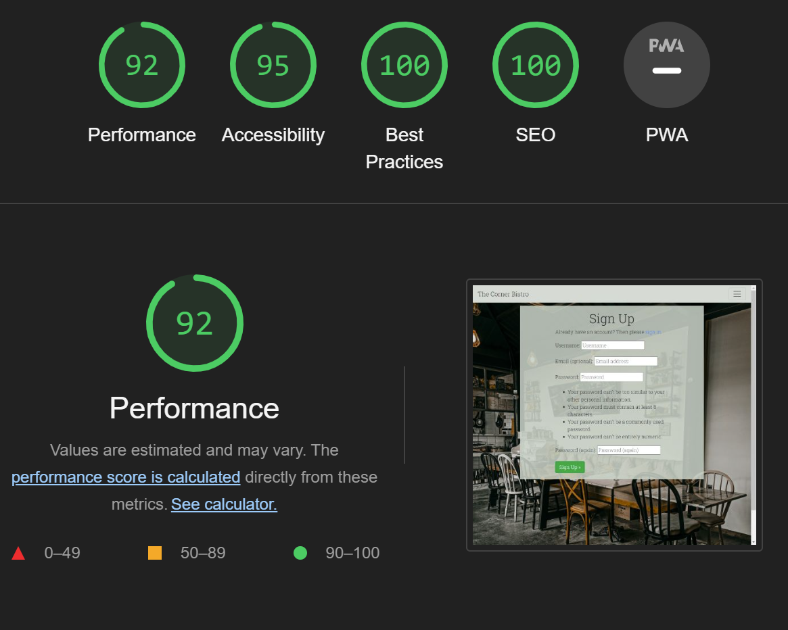 

 
 

 

 
 

## Deployment 

 
 

The first thing you should do when creating a new project is to deploy it as quick as you can to prevent any nasty errors that might be a pain to fix when your project is complete. For this project I used Heroku to deploy too. The framework I used in this project was Django, so the first thing you need to do is to create a Django project in you work space and install all the supporting libraries. Once evrthing is installed you should you should make a migration to the database with a small model to make sure everything works. 

 
 

Just to make a note of this the database used in the workspace (db.sqlite3) does not work when deployed to Heroku so we need a differnt database when deplying. I used ElephantSQL database as it was free and works with Heroku. 

 
 

### Installing Django and Libraries 

 
 

+ Step 1: Django and Gunicorn installation enter in the terminal: 

 
 

        pip3 install 'django<4' gunicorn 

+ Step 2: Install Supporting Libraries in the terminal: 

 
 

        pip3 install dj_database_url==0.5.0 psycopg2 

+ Step 3: Install Cloudinary Libraries in the terminal: 

 
 

        pip3 install dj3-cloudinary-storage 

        pip3 install urllib3==1.26.15 

+ Step 4: Create a requirements file in the terminal: 

 
 

        pip3 freeze --local > requirements.txt 

+ Step 5: Create a Project in the terminal: 

 
 

        django-admin startproject *Your Project name*. 

+ Step 6: Create a App in the terminal: 

 
 

        python3 manage.py startapp *App name* 

+ Step 7: Add App name to the  Installed Apps in setting.py file. 

 
 

+ Step 8: Migrate the changes enter in the terminal: 

 
 

        python3 manage.py migrate 

+ Step 9: Run the local server to make sure that everthing works, enter in the terminal: 

 
 

        python3 manage.py runserver 

+ Step 10: Add your local URL from the preview page to your setting.py file in the section thats called ALLOWED HOST. You must also Add your Heroku URL here too. 

 
 

+ Step 11: Create ElephantSQL Database, by creating/login to your account, creating a new instance, and copying the URL into Heroku (See step 13) 

 
 

+ Step 12: Create a new Heroku project by creating/login to your account and clicking (Create new app). Pick a name for your project and the region that your project is base in. Then click CREATE APP. 

 
 

+ Step 13: In the Heroku app setting click on Reveal Config Vars, add DATABASE_URL as a value with the URL from ElephantSQL as the Key. Repeat this step for SECRET_KEY, DEBUG, CLOUDINARY_URL, Port and DISABLE_COLLECTSTATIC as seen in the image below. 

 
 

    
 

 
 

    
config var Image
  

 
 

    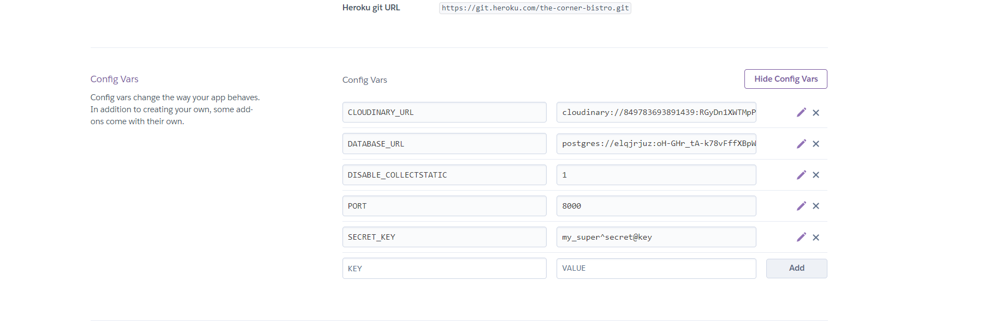 

 
 

    
 

 
 

+ Step 14: IN your workspace create an env.py file to store all your sensative data, like in step 13 add your DATABASE_URL, SECRET_KEY and CLOUDINARY_URL to this file. at the top of this file add import os. 

 
 

    
 

 
 

    
Env.py
  

 
 

    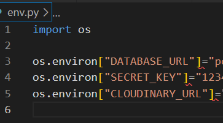 

 
 

    
 

 
 

+ Step 15: Go back to setting.py file and at the top add these lines of code 

 
 

        from pathlib import Path 

        import os 

        import dj_database_url 

        if os.path.isfile('env.py'): 

            import env 

 
 

    
 

 
 

    
Top of Setting.py
  

 
 

    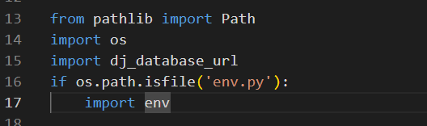 

 
 

    
 

 
 

+ Step 16: In Setting.py find where it say SECRET_KEY and replace it with: 

 
 

        SECRET_KEY = os.environ.get('SECRET_KEY') 

 
 

+ Step 17: IN setting.py find the section DATABASES and comment out the section of code. 

 
 

    
 

 
 

    
Database Comment Out
  

 
 

    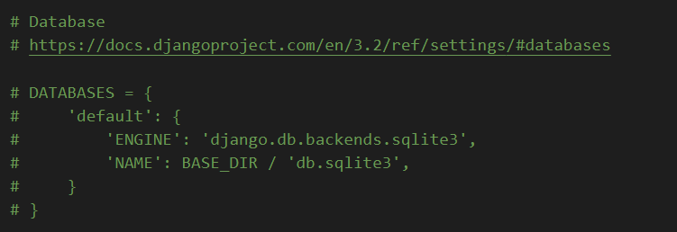 

 
 

    
 

 
 

+ Step 18: IN setting.py just below DATABASES the commented out section, add this code. 

 
 

        DATABASES = { 

            'default': dj_database_url.parse(os.environ.get("DATABASE_URL")) 

        } 

 
 

    
 

 
 

    
Database Add
  

 
 

    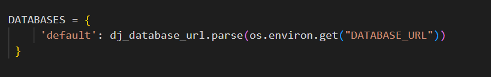 

 
 

    
 

 
 
 

+ Step 19: At this point it is a good idea to make a migration, so in the terminal: 

 
 

        python3 manage.py migrate 

 
 

+ Step 20: IN setting.py in the Installed Apps section add (location added is importent see image below): 

 
 

        'cloudinary_storage', 

        'cloudinary', 

 
 

    
 

 
 

    
Cloudinary
  

 
 

    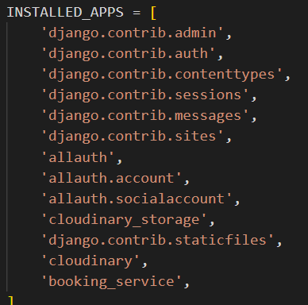 

 
 

    
 

 
 

+ Step 21: IN setting.py find the area called Static files and add this code.(makes Django use cloudinary for storing static files) 

 
 

        STATIC_URL = '/static/' STATICFILES_STORAGE = ('cloudinary_storage.storage.' 'StaticHashedCloudinaryStorage') STATICFILES_DIRS = [os.path.join(BASE_DIR, 'static'), ] STATIC_ROOT = os.path.join(BASE_DIR, 'staticfiles') 

 
 

        MEDIA_URL = '/media/' DEFAULT_FILE_STORAGE = 'cloudinary_storage.storage.MediaCloudinaryStorage' 

 
 

        DEFAULT_AUTO_FIELD = 'django.db.models.BigAutoField' 

 
 

    
 

 
 

    
Cloudinary Static
  

 
 

    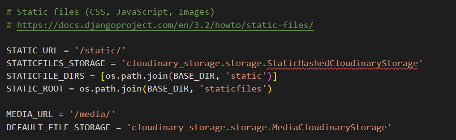 

 
 

    
 

 
 

+ Step 22: IN setting.py add this code just below BASE_DIR 

 
 

        TEMPLATES_DIR = os.path.join(BASE_DIR, 'templates') 

 
 

+ Step 23: create 3 new in the base directory static templates and media 

 
 

+ Step 24: IN setting.py In the templates array add this: 

 
 

        'DIRS': [TEMPLATES_DIR], 

 
 

    
 

 
 

    
TEMPLATES
  

 
 

    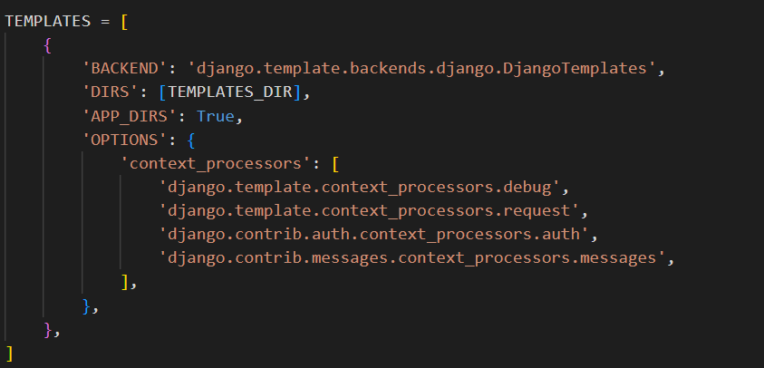 

 
 

    
 

 
 

+ Step 25: Add a Procfile to the root directory make sire the Procfile has a capital P. In the Procfile add this code: 

 
 

        web: gunicorn cornerbistro.wsgi 

 
 

+ Step 26: In your Heroku app navigate to the setting and add buildpack: heroku/python. 

 
 

+ Step 27: Link your GitHub Repo to your project. 

 
 

+ Step 28: Navigate to the deploy section and click on Automatic deployment (mian) 

 
 

+ Step 29: Well done!! 

 
 

## Credits 

 
 

+ This help me set up the time zone correctly  [Timezone](https://www.educative.io/answers/what-is-djangoutilstimezone) 

 
 

+ This helped me set up my crispyform [Crispy Forms](https://simpleisbetterthancomplex.com/tutorial/2018/08/13/how-to-use-bootstrap-4-forms-with-django.html) 

 
 

+ This helped me set up my menu format [Codesandbox](https://codesandbox.io/s/restaurant-menu-with-html-css-3bqzx?file=/index.html:527-5114) 

 
 

### Media 

 
 

Background image was taken from [pexels](https://www.pexels.com/search/bistro/) 

 
 

Favicon was generated by [favicon](https://favicon.io/favicon-generator/) 

 
 

 